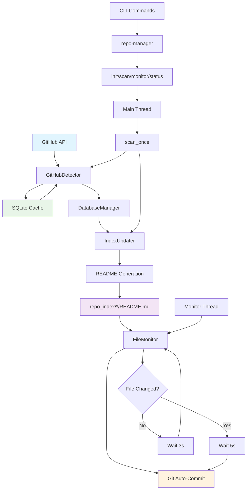

# GitHub Repository Management System



## 概述

这是一个自动化的GitHub仓库管理系统，用于管理和组织GitHub仓库的索引。系统会自动检测GitHub上的仓库，并将它们分类索引到对应的README文件中，实现仓库的自动化分类和链接管理。

## 核心功能

### 🔄 自动仓库检测与索引
- 自动扫描GitHub账户下的所有仓库
- 智能分类到预定义的类别（Default, Crawler, Script, Trading）
- 自动生成仓库链接和描述
- 支持增量更新，只处理新增的仓库

### ⚡ 高性能缓存机制
- **GitHub API缓存**: 5分钟缓存，减少API请求频率
- **SQLite存储**: 高效的本地数据库存储
- **智能过期**: 自动清理过期缓存

### 📁 实时文件监控
- **3秒间隔**: 实时监控 `repo_index/*/README.md` 文件变动
- **5秒延迟提交**: 检测到变动后延迟提交，避免频繁提交
- **独立线程**: 文件监控与主逻辑分离，提高响应性

### 🛠 完整的CLI工具
- `repo-manager init` - 初始化系统配置
- `repo-manager scan` - 执行一次完整扫描
- `repo-manager monitor` - 持续监控模式
- `repo-manager status` - 查看系统状态
- `repo-manager update` - 仅更新索引

## 系统架构

### 主要组件

1. **RepoManager** - 主管理器，协调各个组件
2. **GitHubDetector** - GitHub仓库检测器，带缓存机制
3. **FileMonitor** - 文件变动监控器
4. **IndexUpdater** - 索引更新器，生成README内容
5. **GitManager** - Git操作管理器
6. **DatabaseManager** - SQLite数据库管理器

### 工作流程

1. **初始化阶段**
   - 创建配置文件和数据目录
   - 初始化SQLite数据库
   - 创建分类目录和README模板

2. **扫描阶段**
   - 查询GitHub API获取仓库列表（优先使用缓存）
   - 解析现有README文件中的已索引仓库
   - 识别未索引的新仓库
   - 智能分类新仓库

3. **更新阶段**
   - 生成新的README内容
   - 更新索引数据库
   - 提交变更到Git

4. **监控阶段**
   - 主线程：定期执行完整扫描
   - 监控线程：实时监控README文件变动

## 安装与配置

### 环境要求
- Python 3.7+
- GitHub CLI (`gh`) 已安装并认证
- Git 已配置

### 安装步骤

1. **克隆仓库**
   ```bash
   git clone https://github.com/APE-147/repo-management.git
   cd repo-management
   ```

2. **安装依赖**
   ```bash
   pip install -e .
   ```

3. **设置GitHub用户名**
   ```bash
   export GITHUB_USERNAME=your-username
   ```

4. **初始化系统**
   ```bash
   repo-manager init
   ```

### 配置参数

- `file_monitor_interval`: 3秒 - README文件监控间隔
- `commit_delay`: 5秒 - 变动检测后的提交延迟
- `github_cache_interval`: 300秒 - GitHub查询缓存时间
- `monitor_interval`: 60秒 - 主监控循环间隔

## 使用方法

### 基本命令

```bash
# 查看系统状态
repo-manager status

# 执行一次扫描
repo-manager scan

# 持续监控模式
repo-manager monitor

# 仅更新索引
repo-manager update
```

### macOS自启动服务

```bash
# 安装开机自启动服务
repo-manager install-service

# 卸载服务
repo-manager uninstall-service
```

### 配置管理

```bash
# 设置配置项
repo-manager config --set github_username=myuser

# 查看配置项
repo-manager config --get github_username

# 列出所有配置
repo-manager config --list
```

## 项目结构

```
repo-management/
├── repo_manager/           # 主包目录
│   ├── __init__.py        # 包初始化
│   ├── cli.py             # 命令行界面
│   ├── config.py          # 配置管理
│   ├── core.py            # 核心逻辑
│   ├── database.py        # 数据库管理
│   └── templates.py       # 模板生成
├── repo_index/            # 索引目录
│   ├── Default/           # 默认分类
│   ├── Crawler/           # 爬虫项目
│   ├── Script/            # 脚本工具
│   └── Trading/           # 交易项目
├── .repo-manager/         # 配置和数据目录
│   ├── config.json        # 配置文件
│   └── data/              # 数据目录
│       ├── repositories.db # SQLite数据库
│       ├── cache/         # 缓存文件
│       └── logs/          # 日志文件
├── setup.py               # 安装配置
└── README.md              # 项目文档
```

## 技术特性

### 🚀 性能优化
- SQLite缓存减少GitHub API请求
- 多线程架构提高响应性
- 增量更新减少不必要的操作

### 🔒 安全性
- 不提交敏感信息
- 支持私有仓库处理
- 配置文件本地存储

### 🎯 可靠性
- 错误处理和恢复机制
- 日志记录和监控
- 数据库事务保证

### 🔧 可扩展性
- 模块化设计
- 可配置的分类系统
- 支持自定义模板

## 开发指南

### 代码结构
- 遵循PEP 8编码规范
- 使用类型提示
- 完整的错误处理
- 详细的日志记录

### 测试
```bash
# 运行README监控测试
python test_readme_monitor.py

# 检查缓存机制
repo-manager scan && repo-manager scan
```

## 常见问题

### Q: 如何更改仓库分类？
A: 修改 `config.json` 中的 `categories` 配置，然后重新运行 `repo-manager init`。

### Q: 如何调整监控频率？
A: 使用 `repo-manager config --set file_monitor_interval=5` 调整文件监控间隔。

### Q: 缓存何时过期？
A: GitHub API缓存默认5分钟过期，可通过 `github_cache_interval` 配置调整。

## 版本信息

- **版本**: 1.0.0
- **作者**: APE-147
- **许可证**: MIT

## 更新日志

### v1.0.0 (2025-07-11)
- ✨ 实现自动仓库检测与索引
- ⚡ 添加GitHub API缓存机制
- 📁 实现实时文件监控
- 🛠 完整的CLI工具集
- 🎯 多线程架构设计
- 🔧 macOS自启动服务支持