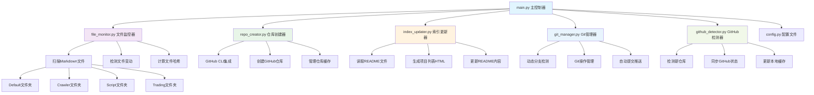

# GitHub仓库自动管理系统



## 功能描述

这是一个自动化的GitHub仓库管理系统，解决GitHub缺乏仓库分类和集合功能的问题。系统能够：

1. **自动监控** - 监控指定目录下的markdown文件变动
2. **自动创建仓库** - 根据markdown文件自动在GitHub上创建对应的仓库
3. **自动更新索引** - 维护各分类的README文件，自动添加项目链接
4. **分类管理** - 支持Default、Crawler、Script、Trading四个分类
5. **动态分支管理** - 自动检测并适配GitHub仓库的默认分支（main/master）
6. **智能同步** - 检测GitHub新仓库并自动更新本地索引

## 系统架构

### 核心组件

- **main.py** - 主控制器，协调所有组件的工作
- **file_monitor.py** - 文件监控器，检测markdown文件的增删改
- **repo_creator.py** - 仓库创建器，使用GitHub CLI创建仓库
- **index_updater.py** - 索引更新器，维护README文件中的项目列表
- **git_manager.py** - Git管理器，处理本地git操作和动态分支检测
- **github_detector.py** - GitHub检测器，检测新仓库并同步状态
- **config.py** - 配置文件，包含所有系统配置

### 文件结构

```
repo-management/
├── main.py              # 主控制器
├── config.py            # 配置文件
├── file_monitor.py      # 文件监控器
├── repo_creator.py      # 仓库创建器
├── index_updater.py     # 索引更新器
├── git_manager.py       # Git管理器
├── github_detector.py   # GitHub检测器
├── clean_cache.py       # 缓存清理工具
├── requirements.txt     # 依赖列表
├── README.md           # 本文件
├── .gitignore          # Git忽略文件
├── repo_cache.json     # 仓库缓存（自动生成）
├── github_repos.json   # GitHub仓库缓存（自动生成）
├── file_states.json    # 文件状态缓存（自动生成）
├── automation.log      # 系统日志（自动生成）
├── Default/
│   └── README.md       # 默认分类项目列表
├── Crawler/
│   └── README.md       # 爬虫分类项目列表
├── Script/
│   └── README.md       # 脚本分类项目列表
└── Trading/
    └── README.md       # 交易分类项目列表
```

## 安装和配置

### 1. 安装GitHub CLI

```bash
# macOS
brew install gh

# 其他系统请参考：https://cli.github.com/
```

### 2. 认证GitHub CLI

```bash
gh auth login
```

### 3. 配置系统

编辑 `config.py` 文件，设置你的GitHub用户名：

```python
GITHUB_USERNAME = "your-username"  # 替换为你的GitHub用户名
```

### 4. 设置Python环境

```bash
# 确保Python 3.7+
python3 --version

# 安装依赖（如果需要扩展功能）
pip3 install -r requirements.txt
```

## 使用方法

### 命令行模式

```bash
# 执行一次性扫描和处理
python3 main.py scan

# 初始化扫描（检查现有文件）
python3 main.py init

# 仅更新README索引
python3 main.py update

# 持续监控模式（默认）
python3 main.py
```

### 自动化流程

1. **文件监控** - 系统每60秒检查一次markdown文件变动
2. **仓库创建** - 发现新的markdown文件时，自动创建对应的GitHub仓库
3. **索引更新** - 自动更新各分类README文件中的项目列表
4. **日志记录** - 所有操作都会记录到日志文件

### 文件组织规则

- 将项目的markdown文件放入对应的分类文件夹
- 文件名将作为GitHub仓库名
- 文件内容的第一行或第一个标题将作为仓库描述
- README.md文件会被忽略（不会创建仓库）

## 配置项说明

### config.py 主要配置

```python
# 基础路径
BASE_DIR = Path("/path/to/repo-management")

# 仓库分类
REPO_CATEGORIES = {
    "Default": BASE_DIR / "Default",
    "Crawler": BASE_DIR / "Crawler", 
    "Script": BASE_DIR / "Script",
    "Trading": BASE_DIR / "Trading"
}

# GitHub配置
GITHUB_USERNAME = "your-username"

# 监控间隔（秒）
MONITOR_INTERVAL = 60

# 仓库模板
REPO_TEMPLATE = {
    "private": False,
    "auto_init": True,
    "gitignore_template": "Python",
    "license_template": "mit"
}
```

## 工作原理

### 1. 文件监控机制

- 使用文件哈希值检测变动
- 缓存文件状态避免重复处理
- 支持检测新增、修改、删除操作

### 2. 仓库创建流程

- 使用GitHub CLI的 `gh repo create` 命令
- 自动设置仓库属性（公开、README、许可证等）
- 维护仓库缓存避免重复创建

### 3. 索引更新机制

- 使用HTML注释标记自动生成区域
- 生成响应式的项目卡片布局
- 支持CSS样式自定义

## 日志和监控

### 日志文件

- **automation.log** - 主要操作日志
- 包含时间戳、操作类型、结果状态
- 支持控制台和文件双重输出

### 缓存文件

- **repo_cache.json** - 已创建的仓库列表
- **file_states.json** - 文件状态快照

## 故障排除

### 常见问题

1. **GitHub CLI未认证**
   ```bash
   gh auth login
   ```

2. **权限不足**
   - 确保GitHub CLI有创建仓库的权限

3. **文件路径问题**
   - 检查config.py中的路径配置
   - 确保所有目录都存在

4. **仓库名冲突**
   - 系统会跳过已存在的仓库
   - 检查日志文件了解详细信息

### 调试模式

编辑main.py，修改日志级别：

```python
logging.basicConfig(level=logging.DEBUG)
```

## 扩展功能

系统设计为模块化架构，可以轻松扩展：

- 添加新的文件类型监控
- 集成其他代码托管平台
- 添加Webhook支持
- 实现邮件通知
- 添加Web界面

## 贡献

欢迎提交Issue和Pull Request来改进这个项目。

## 许可证

MIT License