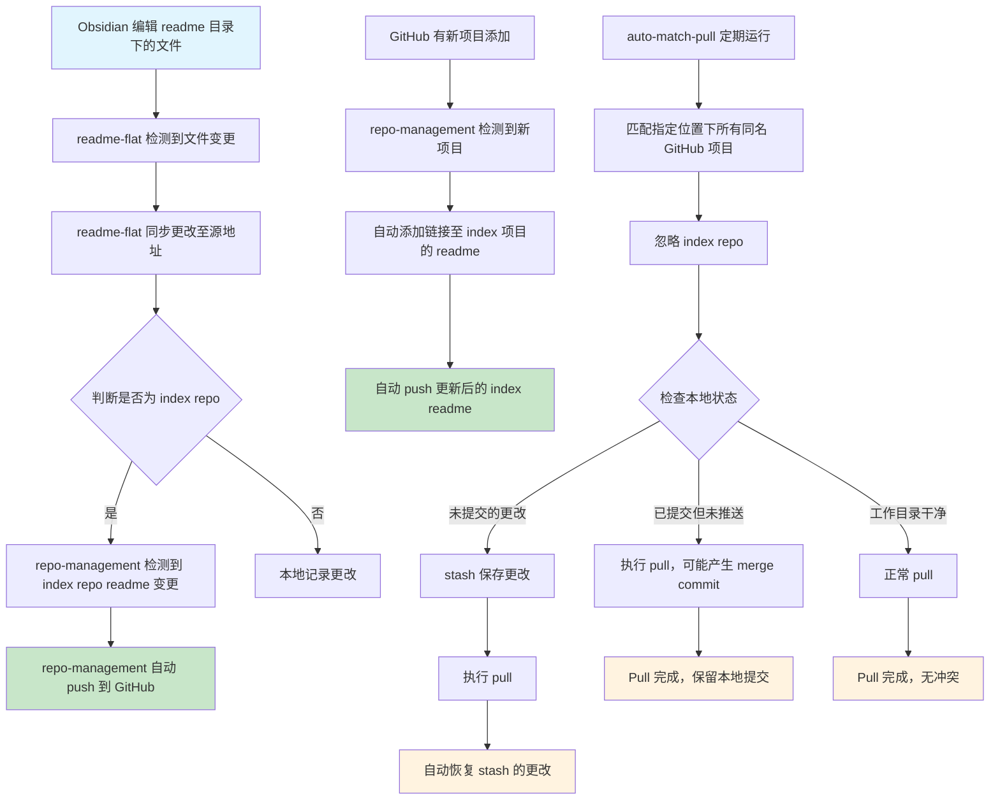

# Default Projects

Default projects

## Project List

我感觉需要有一个结构图串联我的项目

### GitHub 管理
- `readme-flat`: 本地双向同步 obsidian, 支持双向同步 markdown reeadme 的编辑, 保留自定义 readme 文件的层级结构
- `auto-match-pull`: 匹配指定位置下的所有同名 GitHub 项目, 自动 pull, 忽略 index repo, 个人使用
- `repo-management`: 一旦有新项目添加至 GitHub, 自动添加链接至 index 项目的 readme, 一旦repo index 的 readme 有变更, 自动push

**整体流程**
Obsidian 对[readme]目录下的文件进行编辑 -> `readme-flat` 同步更改至源地址 -> 如果是 `index repo markdown` -> `repo-management` 自动push
       -> 如果是其他项目 repo -> 本地记录更改

`auto-match-pull`: 
1. 未提交的更改: 会被stash保存，pull后自动恢复
2. 已提交但未推送: 不会丢失，可能产生merge commit
3. 工作目录干净: 正常pull，无影响

<!-- 自动生成的项目列表将在此处更新 -->

---

*This file is automatically maintained by the repo-management system.*

<!-- AUTO-GENERATED-CONTENT:START -->
- **[readme-flat](https://github.com/APE-147/readme-flat)**
  - 创建时间: 2025-07-10
- **[auto-match-pull](https://github.com/APE-147/auto-match-pull)**
  - 创建时间: 2025-07-10
- **[repo-management](https://github.com/APE-147/repo-management)**
  - 创建时间: 2025-07-10
<!-- AUTO-GENERATED-CONTENT:END -->
